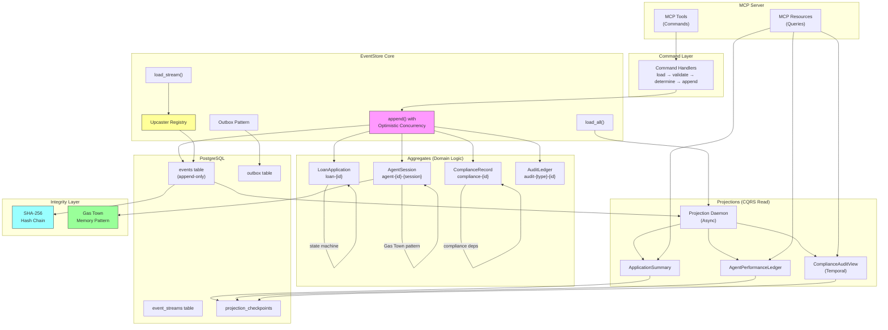
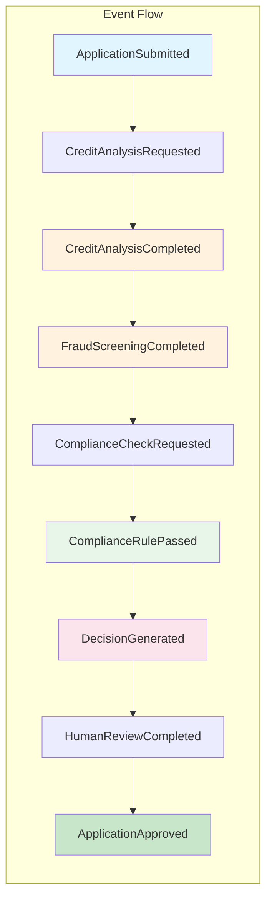
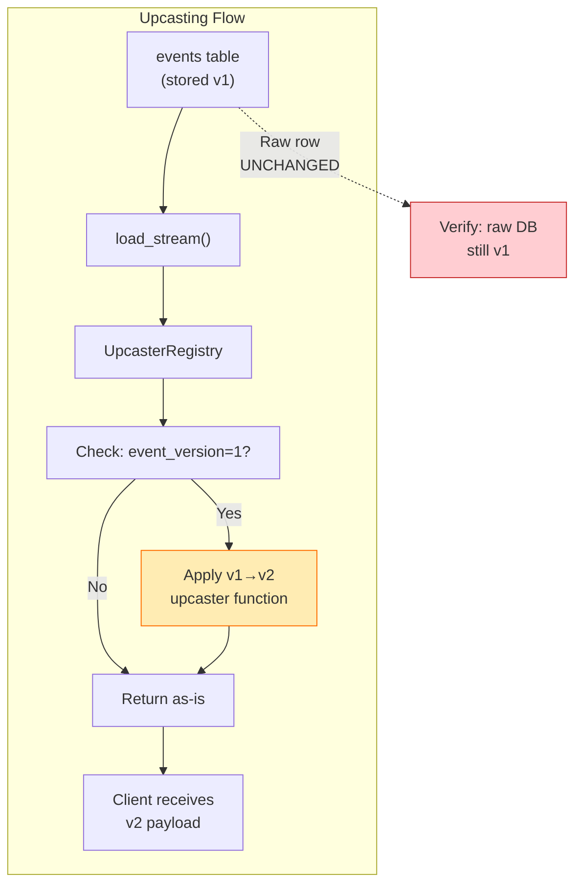
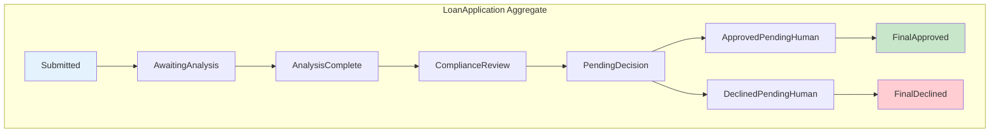
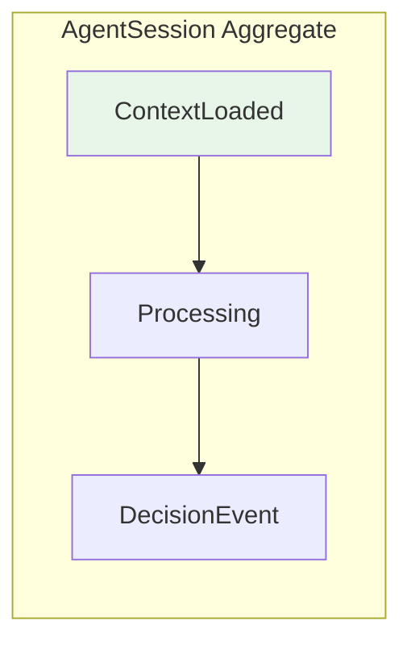
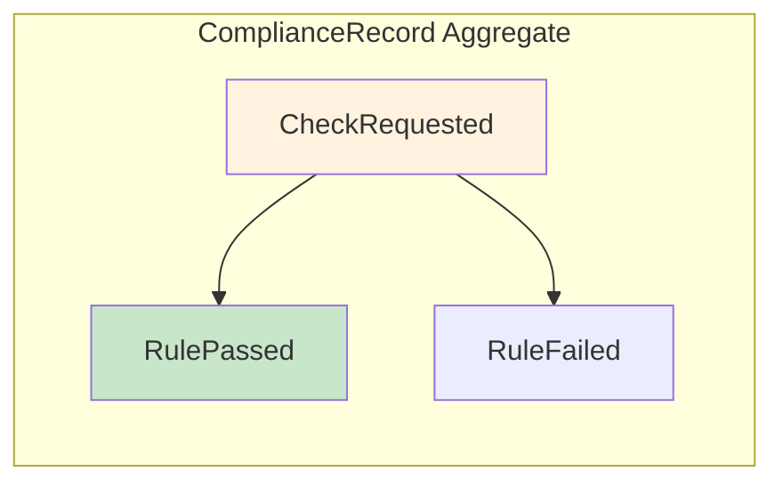
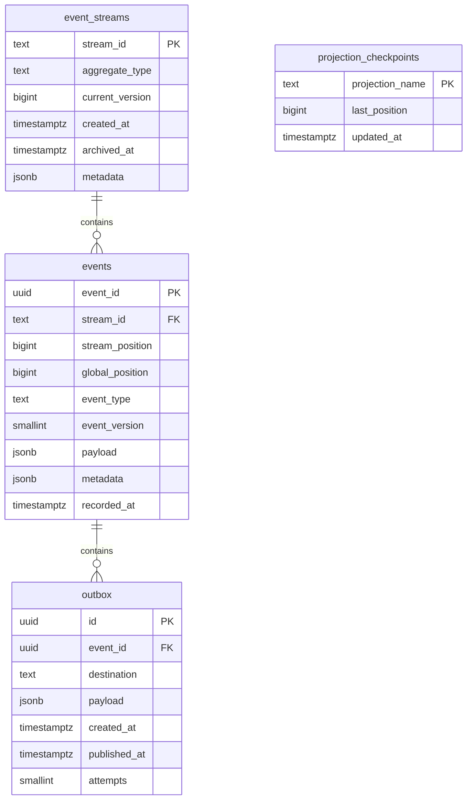
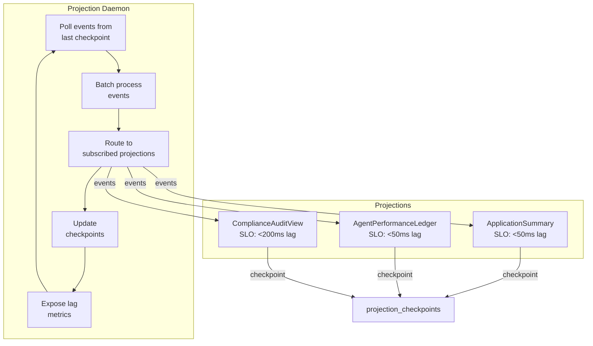
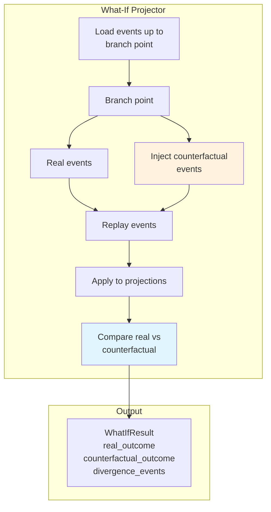

# Architecture Documentation

> Mermaid.js diagrams for The Ledger event store system

---

## System Architecture Overview



---

## Command/Query Flow (Sequence Diagram)

```mermaid
sequenceDiagram
    participant Agent as AI Agent
    participant MCP as MCP Server
    participant Store as EventStore
    participant DB as PostgreSQL
    participant Proj as Projection Daemon
    
    Note over Agent,Proj: Phase 1: Write Path
    
    Agent->>MCP: submit_application(cmd)
    MCP->>Store: handle_submit_application()
    
    rect rgb(240,248,255)
        Note over Store,DB: Optimistic Concurrency Check
    Store->>DB: SELECT current_version FROM event_streams<br/>WHERE stream_id = 'loan-COMP-001'
    DB-->>Store: version = 3
    
    alt expected_version == actual_version
        Store->>DB: BEGIN TRANSACTION
        Store->>DB: INSERT INTO events (...)
        Store->>DB: UPDATE event_streams SET version = 4
        Store->>DB: INSERT INTO outbox (...)
        Store->>DB: COMMIT
        Store-->>MCP: return new_version = 4
        MCP-->>Agent: {success: true, version: 4}
        
        DB-->>Proj: NOTIFY new_event
        Proj->>Proj: Update ApplicationSummary
        Proj->>DB: UPDATE checkpoint
    else expected_version mismatch
        Store-->>MCP: OptimisticConcurrencyError
        MCP-->>Agent: {error: "version_mismatch", expected: 3, actual: 4}
    end
```

---

## Event Lifecycle Flow



---

## Upcasting Flow



---

## Gas Town Recovery Pattern

```mermaid
flowchart LR
    subgraph "Gas Town Recovery"
        Start["Agent starts<br/>session"] --> Load["reconstruct_agent_context()"]
        Load --> Events["Load AgentSession<br/>stream events"]
        Events --> Summarize["Summarize old events<br/>into prose"]
        Events --> Preserve["Preserve verbatim<br/>last 3 events"]
        
        alt "Last event was partial"
            Events -->|Yes| Reconcile["Flag:<br/>NEEDS_RECONCILIATION"]
        else "All complete"
            Events -->|No| Ready["Status: READY"]
        end
        
        Reconcile --> Resume["Agent resolves<br/>partial state"]
        Ready --> Resume
        Resume --> Continue["Continue processing"]
    end
    
    style Reconcile fill:#ffcdd2
    style Ready fill:#c8e6c9
```

---

## Hash Chain Integrity

```mermaid
flowchart TB
    subgraph "Hash Chain Integrity"
        Events["Event Stream"] --> Hash1["Hash Event 1"]
        Hash1 --> Hash2["Hash Event 2<br/>+ Hash1"]
        Hash2 --> Hash3["Hash Event 3<br/>+ Hash2"]
        Hash3 --> Chain["Chain:<br/>H1, H2, H3..."]
        
        Check["run_integrity_check()"] --> Load["Load all events<br/>since last check"]
        Load --> Compute["Compute<br/>expected_hash"]
        Compute --> Compare["Compare with<br/>stored hash"]
        
        alt "Hash matches"
            Compare --> Valid["chain_valid: true<br/>tamper_detected: false"]
        else "Hash mismatch"
            Compare --> Invalid["chain_valid: false<br/>tamper_detected: true"]
        end
    end
    
    style Valid fill:#c8e6c9
    style Invalid fill:#ffcdd2
```

---

## Aggregate State Machines







---

## Database Schema



---

## MCP Tool/Resource Architecture

```mermaid
flowchart TB
    subgraph "MCP Server"
        subgraph "Tools (Commands)"
            T1["submit_application"]
            T2["record_credit_analysis"]
            T3["record_fraud_screening"]
            T4["record_compliance_check"]
            T5["generate_decision"]
            T6["record_human_review"]
            T7["start_agent_session"]
            T8["run_integrity_check"]
        end
        
        subgraph "Resources (Queries)"
            R1["ledger://applications/{id}"]
            R2["ledger://applications/{id}/compliance"]
            R3["ledger://applications/{id}/audit-trail"]
            R4["ledger://agents/{id}/performance"]
            R5["ledger://agents/{id}/sessions/{session_id}"]
            R6["ledger://ledger/health"]
        end
    end
    
    subgraph "Backing Stores"
        Proj1["ApplicationSummary"]
        Proj2["ComplianceAuditView"]
        Proj3["AgentPerformanceLedger"]
        Streams["Event Streams"]
    end
    
    T1 --> Streams
    T2 --> Streams
    T3 --> Streams
    T4 --> Streams
    T5 --> Streams
    T6 --> Streams
    T7 --> Streams
    T8 --> Streams
    
    R1 --> Proj1
    R2 --> Proj2
    R3 --> Streams
    R4 --> Proj3
    R5 --> Streams
    R6 --> Proj1
```



---

## Projection Daemon Architecture



---

## What-If Projection (Bonus Phase 6)


